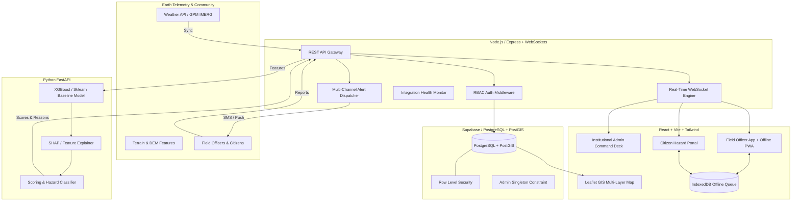

# 🛡️ BhoomiRakshak: AI Landslide Intelligence Sentinel (NER)
### Smart India Hackathon 2026 • Problem ID: SIH26001
**Theme:** Disaster Management • **Organization:** Ministry of Development of North Eastern Region (MDoNER)

---

## 📌 Executive Summary
**BhoomiRakshak** is an institutional-grade, deployable landslide early warning and geospatial risk monitoring platform engineered for India's 8 North Eastern Region (NER) states (*Assam, Arunachal Pradesh, Manipur, Meghalaya, Mizoram, Nagaland, Sikkim, Tripura*).

The system continuously assesses slope failure susceptibility, precipitation saturation thresholds, and ground deformation to warn district administrations and vulnerable communities before catastrophic movements occur.

---

## 🚫 Strict Zero-Data Policy
As mandated by disaster management engineering principles, **no demo, mock, sample, or fabricated data exists in BhoomiRakshak**.
- Every table/collection starts **completely empty**.
- Every component, metric card, GIS map, and chart renders an honest, clinical empty state (*e.g., "No active alerts in registry", "Awaiting sensor telemetry"*).
- Rainfall numbers, hazard scores, and field reports are never fabricated.

---

## 🏛️ System Architecture



---

## 🔐 Roles & Access Control (RBAC)

1. **ADMINISTRATOR (Single Active Account Enforced):**
   - Strictly limited to **exactly one active account** via database constraint/trigger (`trg_single_active_admin`).
   - Omniscient access: registers monitored sectors, provisions field officers, broadcasts emergency alerts.
2. **FIELD OFFICER (District-Scoped Foreign Key):**
   - Each account is linked to **exactly one assigned region/district** (`region_id` foreign key).
   - Can only review, triage, and verify field reports within their designated district.
   - Provisioned exclusively by the Administrator (no public self-signup).
3. **END USER (CITIZEN):**
   - Public self-registration via mobile phone / email and district selection.
   - View local district advisories, subscribe to free SMS emergency warnings, and submit geo-tagged hazard observations.

---

## 📶 Offline-First Resilient Operation
Operating in the rugged Indo-Burma ranges requires continuous uptime despite signal dropouts:
- **Service Worker + IndexedDB Queue:** Field and citizen observations submitted without an internet connection are saved locally in IndexedDB with a unique UUID `idempotency_key`.
- **Auto-Sync Engine:** As soon as cellular network or Wi-Fi reconnects (`online` event), pending reports are automatically replayed and flushed to the backend without duplicate entries.

---

## ⚡ Multi-Channel Emergency Warning Dispatch
Every dispatched alert logs an authentic delivery status across three channels:
1. **Website & App Live Broadcast:** Real-time push via WebSockets to all connected command center consoles and field officers.
2. **SMS Gateway:** Twilio or MSG91 integration with automatic fallback to `not_configured` if keys are omitted.
3. **In-App Web Push:** VAPID Web Push protocol for subscribed field devices.
*All delivery reports (`sent`, `failed`, `not_configured`) are visibly audited in the admin Alerts Console.*

---

## ⚙️ Quick Start & Local Execution

### 1. Prerequisites
- **Node.js** (v18+ or v20+)
- **Python** (3.10+)

### 2. Configure Environment
Copy `.env.example` to `server/.env`:
```bash
cp .env.example server/.env
```

### 3. Start Backend Core (Express + WebSockets)
```bash
cd server
npm install
npm start
# Server listening on http://localhost:5000 (REST: /api, WebSockets: /ws)
```

### 4. Start Python AI Risk Engine (FastAPI)
```bash
cd ml_service
python main.py
# FastAPI running on http://127.0.0.1:8000 (Health probe: /ml/health)
```

### 5. Start Frontend Client (React + Vite)
```bash
cd client
npm install
npm run dev
# Vite dev server running on http://localhost:3000
```

---

## 📉 Graceful Degradation Matrix

| Feature / Service | Required API Key | Behavior when Key is Missing |
| :--- | :--- | :--- |
| **Database & PostGIS** | `SUPABASE_URL`, `SUPABASE_KEY` | Gracefully falls back to embedded PostGIS-compatible local engine. All spatial queries and constraints operate seamlessly. |
| **Weather & Rainfall** | `WEATHER_API_KEY` | Automatically pulls free real-time precipitation telemetry from Open-Meteo for NER coordinates. Sensor table remains honestly empty until sync is triggered. |
| **Emergency SMS** | `TWILIO_ACCOUNT_SID` or `MSG91_AUTH_KEY` | Logs honest `status: "not_configured"` in the alert audit trail. Does not simulate fake transmissions. |
| **In-App Push** | `VAPID_PUBLIC_KEY`, `VAPID_PRIVATE_KEY` | Records honest `status: "not_configured"` in delivery reports. |
| **GIS Satellite Tiles** | `VITE_MAPBOX_TOKEN` | Defaults to free, crisp CartoDB Voyager and OpenStreetMap tiles requiring zero billing keys. |
| **ML Inference Engine** | Local FastAPI Port 8000 | If offline, the admin status screen displays `not_configured` without crashing the core server. |

---

## 📁 Database Schema (PostgreSQL + PostGIS)
Database migration scripts are provided in `supabase/migrations/`:
- `001_initial_schema.sql`: Tables (`regions`, `users`, `risk_zones`, `sensor_rainfall_data`, `terrain_features`, `historical_landslides`, `field_reports`, `alerts`, `alert_subscriptions`, `api_connection_status`), PostGIS geometry indices, and single-admin enforcement trigger.
- `002_rls_policies.sql`: Complete Row Level Security policies enforcing data isolation between Admins, Field Officers, and Citizens.

---

## 👥 Hackathon Team (SIH26001)
- **Project:** BhoomiRakshak
- **Description:** AI-based early warning and landslide risk monitoring system for India's North Eastern Region — real-time GIS risk mapping, ML-driven predictions, and multi-channel alerts (SMS/email/push) for admins, field officers, and citizens. Built for SIH26001 (MDoNER).
- **Problem Statement:** AI-Based Early Warning and Landslide Risk Monitoring System in NER
- **Category:** Software • **Theme:** Disaster Management

